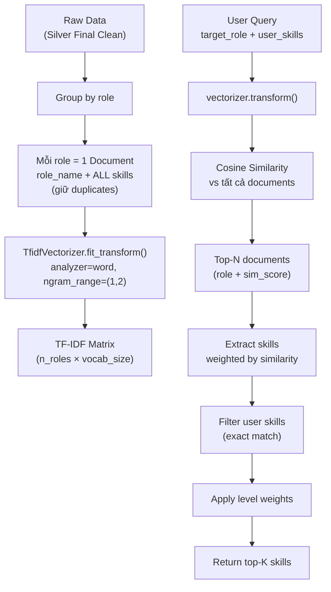

# Unified TF-IDF Document Model — Implementation Plan

## Vấn đề hiện tại

Hiện tại matching **tách rời** role và skill:
1. Tìm role tương tự → lấy skills của role đó
2. Filter bỏ user skills

→ Role matching và skill matching là **2 bước riêng biệt**, không xét mối quan hệ giữa role + skill cùng lúc.

## Ý tưởng mới

**Gộp role + skills thành 1 "document"**, dùng TF-IDF cosine similarity trên document đó.

### Ví dụ trực quan

```
Document cho "data engineer" (100 jobs trong dataset):
┌──────────────────────────────────────────────────────────────┐
│ "data engineer python python python sql sql spark spark aws" │
│  ↑ role name    ↑ python xuất hiện 80/100 jobs → TF cao     │
└──────────────────────────────────────────────────────────────┘

Query của user (muốn làm "data engineer", đã biết python + sql):
┌──────────────────────────────────┐
│ "data engineer python sql"       │
└──────────────────────────────────┘

→ Cosine similarity cao vì overlap CẢ role lẫn skills
→ "data engineering" (role khác nhưng tương tự) cũng match vì share n-grams
```

## Kiến trúc mới



## Chi tiết Implementation

### 1. Data Structures

```python
class TFIDFRecommender:
    # Fitted vectorizer trên tất cả documents
    _vectorizer: TfidfVectorizer
    
    # TF-IDF matrix: (n_roles, vocab_size)
    _doc_matrix: sparse matrix
    
    # Metadata cho mỗi document (index tương ứng)
    _doc_roles: list[str]           # ["data engineer", "data analyst", ...]
    _doc_skill_counts: list[dict]   # [{"python": 80, "sql": 60}, ...]
    _doc_job_counts: list[int]      # [100, 50, ...]  tổng jobs mỗi role
```

### 2. Build Phase (`_build_tfidf_matrix`)

```
Input: DataFrame (job_title_canonical, skills_canonical)
  
Bước 1: Chuẩn hóa
  - role = normalize(job_title_canonical)
  - skills = parse_skills_lower(skills_canonical)

Bước 2: Group by role
  - Đếm tổng jobs mỗi role
  - Đếm số lần mỗi skill xuất hiện trong role
  - Lọc role rác (< 3 jobs)

Bước 3: Tạo documents
  Với mỗi role:
    - Lấy tất cả skills từ tất cả jobs (giữ duplicates)
    - Document text = f"{role} {role} {skill1} {skill1} ... {skillN}"
    - Role name lặp 2 lần để có trọng số trong TF-IDF
    - Skills giữ nguyên frequency từ data

Bước 4: Fit TF-IDF
  - TfidfVectorizer(analyzer="word", ngram_range=(1, 2), 
                     sublinear_tf=True, min_df=2)
  - word-level unigram + bigram để bắt "machine learning", "data engineer"
  - sublinear_tf=True: dùng 1 + log(tf) thay vì raw tf → tránh skill quá phổ biến dominate
```

### 3. Query Phase (`query`)

```
Input: target_role, user_skills, level, top_k

Bước 1: Tạo query string
  query_text = f"{target_role} {' '.join(user_skills)}"

Bước 2: Transform & cosine similarity
  query_vec = vectorizer.transform([query_text])
  sims = cosine_similarity(query_vec, doc_matrix).flatten()

Bước 3: Lấy top-N documents (roles) tương tự
  - Sort by similarity, lấy top MAX_SIMILAR_ROLES
  - Filter sim >= SIMILARITY_THRESHOLD

Bước 4: Extract & aggregate skills
  Với mỗi matched role (role_name, sim_score):
    skill_weights[skill] += (count / total_jobs) * sim_score
  
  → Mỗi skill có weighted score = TF trong role × similarity

Bước 5: Filter user skills (exact match trên normalized text)

Bước 6: Apply level weights (senior boost leadership, etc.)

Bước 7: Sort & return top-K
```

### 4. Ưu điểm so với cách cũ

| Aspect | Cách cũ | Cách mới |
|--------|---------|----------|
| Role matching | Tách riêng, char n-gram | Gộp chung trong 1 TF-IDF space |
| Skill matching | Tách riêng, char n-gram | Gộp chung → skill context ảnh hưởng role match |
| "data engineer" + ["python"] | Chỉ match role, bỏ qua python khi tìm role | Match cả role + python → ưu tiên DE roles dùng python |
| Cross-signal | Không có | Có! Role "ML engineer" + skill "tensorflow" boost lẫn nhau |
| Complexity | 3 indexes (role, skill, matrix) | 1 index duy nhất |

### 5. Config mặc định

```python
SIMILARITY_THRESHOLD = 0.1    # Ngưỡng thấp hơn vì document dài hơn
MAX_SIMILAR_ROLES = 10        # Lấy nhiều hơn vì aggregate sẽ tốt hơn
ROLE_NAME_REPEAT = 2          # Lặp role name bao nhiêu lần trong document
```

> [!NOTE]
> Ngưỡng similarity thấp hơn (0.1 vs 0.3) vì documents dài hơn → cosine similarity tự nhiên thấp hơn do curse of dimensionality.

## Files cần thay đổi

| File | Thay đổi |
|------|----------|
| `model_tfidf.py` | **Viết lại hoàn toàn** — unified document model |
| `01_build_tfidf.py` | Không đổi (interface giữ nguyên) |
| `02_tfidf_recommend.py` | Không đổi (interface giữ nguyên) |
| `recommend.py` | Không đổi (gọi qua `query()`) |

> [!IMPORTANT]
> Public API (`query()`, `load_from_minio()`, `load_matrix()`, `get_roles()`, `get_role_skills()`) giữ nguyên signature → backward compatible.
