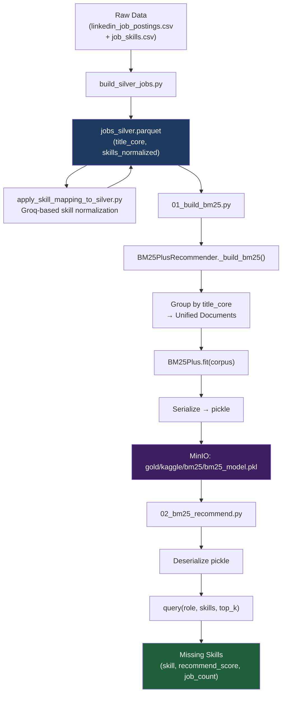

# Unified BM25Plus Document Model — Kiến trúc & Thiết kế

## Bối cảnh: Từ TF-IDF đến BM25+

### Vấn đề của TF-IDF (phương pháp cũ)

Phiên bản đầu sử dụng `TfidfVectorizer` + Cosine Similarity:

```
Document = TF-IDF vector (sparse)
Query    = TF-IDF vector (sparse)
Score    = cosine_similarity(query, document)
```

**Hạn chế:**
- Không có cơ chế **TF saturation** → skill quá phổ biến (vd: "communication") dominate score
- Không có **length normalization** → Unified Document rất dài, gây lệch score
- Cần maintain thêm `TfidfVectorizer` object → phức tạp khi serialize
- Cosine similarity trên document dài bị **curse of dimensionality** → score tự nhiên thấp

### Giải pháp: Chuyển sang BM25+

BM25+ giải quyết tất cả vấn đề trên:

| Vấn đề TF-IDF | Giải pháp BM25+ |
|----------------|-----------------|
| TF không bão hòa | $k_1$ parameter kiểm soát saturation |
| Không normalize length | $b$ parameter normalize theo avgdl |
| Score = 0 cho rare terms | $\delta$ đảm bảo score > 0 |
| Cần vectorizer riêng | Tự chứa inverted index |
| Cosine similarity thấp trên doc dài | BM25 score không bị ảnh hưởng |

---

## Kiến trúc hiện tại

### Data Flow


```mermaid
flowchart TD
    A["Raw Data<br/>(linkedin_job_postings.csv<br/>+ job_skills.csv)"]
    B["build_silver_jobs.py"]
    C["jobs_silver.parquet<br/>(title_core, skills_normalized)"]
    D["apply_skill_mapping_to_silver.py<br/>Groq-based skill normalization"]
    E["01_build_bm25.py"]
    F["BM25PlusRecommender._build_bm25()"]
    G["Group by title_core<br/>→ Unified Documents"]
    H["BM25Plus.fit(corpus)"]
    I["Serialize → pickle"]
    J["MinIO: gold/kaggle/bm25/bm25_model.pkl"]
    K["02_bm25_recommend.py"]
    L["Deserialize pickle"]
    M["query(role, skills, top_k)"]
    N["Missing Skills<br/>(skill, recommend_score, job_count)"]

    A --> B --> C --> D --> C
    C --> E --> F --> G --> H --> I --> J
    J --> K --> L --> M --> N

    style C fill:#1e3a5f,color:#fff
    style J fill:#3b1f5f,color:#fff
    style N fill:#1f5f3b,color:#fff
```

### Class Design

```python
class BM25PlusRecommender:
    # ─── Config ───
    SCORE_THRESHOLD = 0.0       # Ngưỡng BM25 tối thiểu
    MAX_SIMILAR_ROLES = 10      # Top N roles để extract skills
    ROLE_NAME_REPEAT = 2        # Boost role name trong document

    # ─── State (serialized qua pickle) ───
    _bm25: BM25Plus             # Fitted BM25+ index
    _doc_roles: list[str]       # ["data engineer", "data analyst", ...]
    _doc_skill_counts: list[dict]  # [{"python": 90, "sql": 85}, ...]
    _doc_job_counts: list[int]  # [100, 50, ...]

    # ─── API ───
    load_from_minio(object_name)  # Build từ MinIO Silver
    load_from_dataframe(df)       # Build từ DataFrame
    query(role, skills, top_k)    # → list[dict]
    get_roles()                   # → list[str]
    get_role_skills(role, top_k)  # → list[dict]
    find_similar_roles(role, top_k) # → list[tuple]
```

### Dữ liệu đầu vào

| Cột trong Silver | Ý nghĩa | Xử lý |
|-----------------|---------|-------|
| `title_core` | Job title đã chuẩn hóa (bỏ seniority, work_mode, lemmatized) | `normalize_text_lower()` → role name |
| `skills_normalized` | Skills đã ánh xạ qua Groq whitelist | `parse_skills_lower()` → list[str] |

---

## So sánh với cách tiếp cận khác

### 1. Item-based (1 job = 1 document)

```
Pros: Giữ nguyên context từng job
Cons: 124K documents → query chậm, noise cao, mỗi job viết khác nhau
```

### 2. Unified Role (hiện tại: 1 role = 1 document)

```
Pros: Denoising, phản ánh phân phối skill thực tế, ~2K-5K documents → query nhanh
Cons: Mất context individual job (nhưng không cần vì mục đích là gợi ý skill, không gợi ý job)
```

### 3. Embedding-only (FAISS)

```
Pros: Hiểu ngữ nghĩa, match semantic
Cons: Không biết tần suất, có thể match sai (semantic drift), không interpretable
```

### 4. Hybrid BM25+ + FAISS (hiện tại)

```
Pros: Kết hợp exact match + semantic, robust, interpretable
Cons: Cần maintain 2 systems, nhưng chi phí thấp vì BM25+ rất nhẹ
```

---

## Files liên quan

| File | Chức năng | Thay đổi khi refactor |
|------|-----------|----------------------|
| `src/recommendation/core/model_bm25.py` | Core BM25+ logic | ✅ Đã cập nhật: dùng `title_core` + `skills_normalized` |
| `src/recommendation/core/hybrid_rrf.py` | RRF fusion | Không thay đổi |
| `src/recommendation/utils/text.py` | Text normalization | Không thay đổi |
| `scripts/recommend/01_build_bm25.py` | Build & upload pickle | Không thay đổi (gọi API đã sửa) |
| `scripts/recommend/02_bm25_recommend.py` | Load & query | Không thay đổi |
| `scripts/recommend/03_hybrid_rrf.py` | Hybrid pipeline | Không thay đổi |

### Thay đổi chính so với code cũ

```diff
# model_bm25.py

- from src.config import SILVER_KAGGLE_FINAL_CLEAN
+ SILVER_KAGGLE_JOBS = "silver/kaggle/jobs_silver.parquet"
+ COL_TITLE = "title_core"
+ COL_SKILLS = "skills_normalized"

  def _build_bm25(self, df):
-     df = df[["job_title_canonical", "skills_canonical"]].copy()
-     df["role"] = df["job_title_canonical"].apply(normalize_text_lower)
-     df["skills_list"] = df["skills_canonical"].apply(parse_skills_lower)
+     df = df[[COL_TITLE, COL_SKILLS]].copy()
+     df["role"] = df[COL_TITLE].apply(normalize_text_lower)
+     df["skills_list"] = df[COL_SKILLS].apply(parse_skills_lower)
```

**Lý do thay đổi:**
- `job_title_canonical` / `skills_canonical` là tên cột của **crawler pipeline** (pipeline khác)
- Kaggle Silver pipeline thực tế output `title_core` / `skills_normalized` (theo `SILVER_COLUMNS` trong `silver_config.py`)
- Đường dẫn cũ `silver/kaggle/05_final_clean/...` không tồn tại trong Kaggle pipeline, Kaggle Silver nằm tại `silver/kaggle/jobs_silver.parquet`
